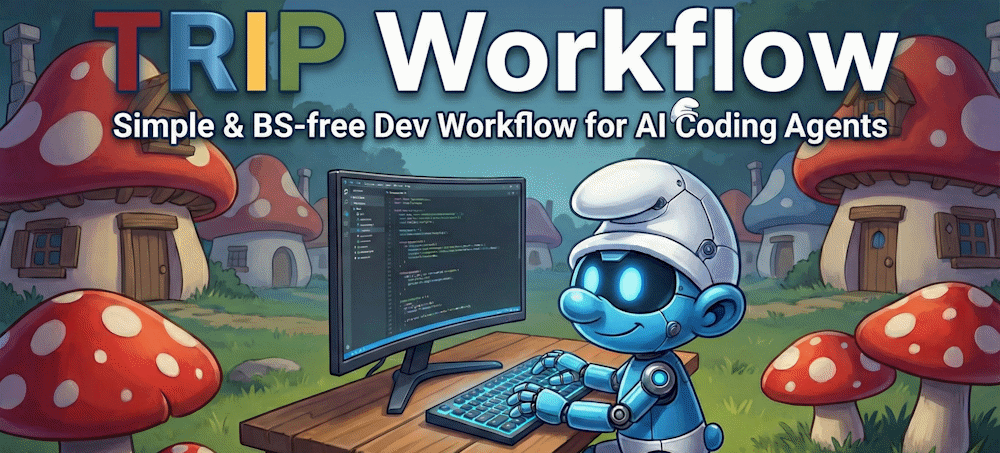

      

## What is TRIP?

A structured development workflow for AI coding agents that brings **memory**, **consistency**, and **reduced hallucination** (only humans should) to AI-assisted development. TRIP helps you enter flow state and eat features like buttered noodles.
It is also the acronym (reversed) of the 4-phases development cycle: **P**lan, **I**mplement, **R**eview, **T**est.

TRIP was initially designed for Claude Code using the [Agent Skills](https://agentskills.io/home) open standard (`SKILL.md`). Also compatible with OpenCode, Codex CLI, Mistral Vibe and more.

## Why TRIP?

There are tons of AI coding workflows out there like [Superpowers](https://github.com/obra/superpowers), [BMAD](https://github.com/bmad-code-org/BMAD-METHOD), [Gastown](https://github.com/steveyegge/gastown) and countless others. They might be powerful, but overwhelming for many of us dumb asses.

Even the "simple" ones come with:

- 47 different commands & skills to memorize
- Sub-agents swarm for God-knows-what
- Mutlti-chapters courses (sometimes paid lol)

**TRIP is different.** It's deliberately minimal:

| That's it           | Just these            |
| ------------------- | --------------------- |
| `/TRIP-1-plan`      | Think before you code |
| `/TRIP-2-implement` | Write the code        |
| `/TRIP-3-review`    | Check the code        |
| `/TRIP-4-test`      | Test the code         |

Four skills. One architecture file. Zero PhD required.

The onboarding is: copy the folder, run init, start coding. If you can count to 4, you can TRIP.

It was kept stupid simple because **the goal is to ship features, not to master a workflow**. The workflow should disappear into the background, not become a project of its own.

## Getting Started

1. Copy the `skills/` folder contents to your repo's `.claude/skills/` or whatever
2. Run `/TRIP-init [YourProjectName]`
3. Follow the interactive prompts
4. Review and approve the generated ARCHI.md

### Additional For Codex & Mistral users

Also copy `AskUserQuestion/` to your agent `/skills/`, it provides the `AskUserQuestion` tool that TRIP workflow rely on (missing on those two agents BOOOO).  

Et voila ! Start using the skills like `/TRIP-1-plan auth for this webapp`, `/TRIP-2-implement @auth-plan.md`, etc.

https://github.com/user-attachments/assets/d37bbc60-1868-4fa8-9be6-083b60d6a53d

## The Heart of TRIP: ARCHI.md

The `ARCHI.md` file is the **central nervous system** of this workflow. It serves as the AI agent's **long-term memory** of your codebase.

### Why ARCHI.md Matters

**1. Persistent Context Across Sessions**

AI agents have no memory between sessions. Every new conversation starts from zero. ARCHI.md solves this by providing a comprehensive, always-up-to-date snapshot of your architecture that the agent reads at the start of each task. Unlike tool-specific files like `CLAUDE.md` or `AGENTS.md`, ARCHI.md is purely about architecture. It's tool-agnostic, so it works with any agent. You can still reference it from your `CLAUDE.md` to include it in all conversations.

**2. Token Savings & Reduced Hallucination**

Without ARCHI.md, your agent must glob, grep, and read multiple files to piece together the architecture from scratch for every single session. This wastes tokens and leads to guessing: _"There's probably a utils folder..."_, _"This project likely uses Redux..."_. ARCHI.md eliminates both problems. The agent gets the full picture in one read for minimal exploration & hallucination.

**3. Balanced Detail vs Token Usage**

ARCHI.md is designed to be:

- **Detailed enough** to provide meaningful context, **concise enough** to not waste tokens
- **Structured** for quick navigation
- **Updated** after every architectural change

It's not a dump of your entire codebase, rather a curated architectural guide.

## The Init Process

The `TRIP-init` skill is a **script written in human language** that programmatically bootstraps the TRIP workflow in any repository.

### What Init Does

1. **Creates the docs structure** - Folders for plans, changelogs, reviews, tests, memos
2. **Explores your codebase** - Identifies languages, frameworks, patterns, conventions
3. **Classifies your project** - Web frontend? CLI tool? Embedded firmware? Library?
4. **Generates ARCHI.md** - Tailored to your specific project type
5. **Customizes the skills** - Replaces placeholders with your project's specifics

### The Placeholder System

The generic TRIP skills contain placeholders like:

- `[PROJECT_NAME]` - Your project's name
- `[VERSION_FILE]` - Where your version is stored (package.json, Cargo.toml, etc.)
- `[ADAPT_TO_PROJECT: ...]` - Sections to customize

Init walks you through questions and replaces these placeholders based on your answers, creating a workflow tailored to your project.

## More Skills

### `/TRIP-hotfix`

Streamlined workflow for production emergencies. Bypasses full TRIP for genuine crises (or lazy debugging).

### `/TRIP-research`

Exploratory investigation with defined compute level. For feasibility studies and technology evaluation. Produces documented findings, not production code.

### `/TRIP-compact`

Run this skill to compact ARCHI.md size while preserving relevance, accuracy, and coverage through summarization and restructuring. Token calculator script included.
As a rule of thumb, ARCHI.md should not exceed ~10% of context window.

## Multi-Agent: Use Different LLMs at Different Steps

Since ARCHI.md is tool-agnostic and skills follow an open standard, nothing stops you from mixing agents across the TRIP phases. In fact, it's a strong recommendation. Just like you wouldn't smell your own fart, an LLM is unlikely to catch bugs in its own implementation. Introducing a different model to catch what the first one missed has become a common practice.

To date, the best combo is Claude Opus 4.6 + Codex 5.3, for example:

1. **Plan** with Claude Code — great at interactive discovery and architecture
2. **Implement** with Claude Code — it wrote the plan, it knows the intent
3. **Review** with Codex — catches what Claude missed  
4. **Review the review** back in Claude Code — sanity-check the findings, fix what's real, dismiss what's not  
5. **Test** with either — whoever you trust more with your test framework

The key is that ARCHI.md, the plans and the changelogs all live in `docs/`, they're just text files. Any agent can read them. You're not locked into one tool for the entire cycle.

## MCP Servers: Less Is More

Every MCP server you add is extra context, extra latency, and extra confusion. Keep it minimal. The one use case where MCP genuinely shines is **up-to-date documentation**, so your agent stops hallucinating deprecated APIs. [ref.tools](https://ref.tools/) is a good option: one server, many docs, no bloat.

## Important: Adapt to Your Use Case

**This workflow is a starting point, not a rigid framework.**

The initial setup works out of the box, but you will eventually need to fine-tune the workflow. Use your brain to customize.  
The best version of this workflow is the one **you** create by adapting it to your reality.

## Contributing

PRs & forks are welcome (improvements, new useful skills,...), but please keep it stupidly simple for all of us fellow regards.

Happy tripping 🍄
