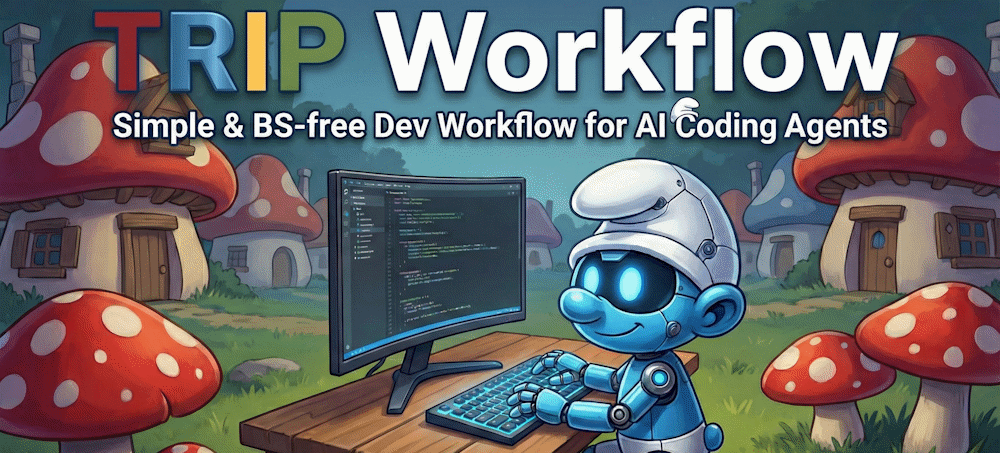
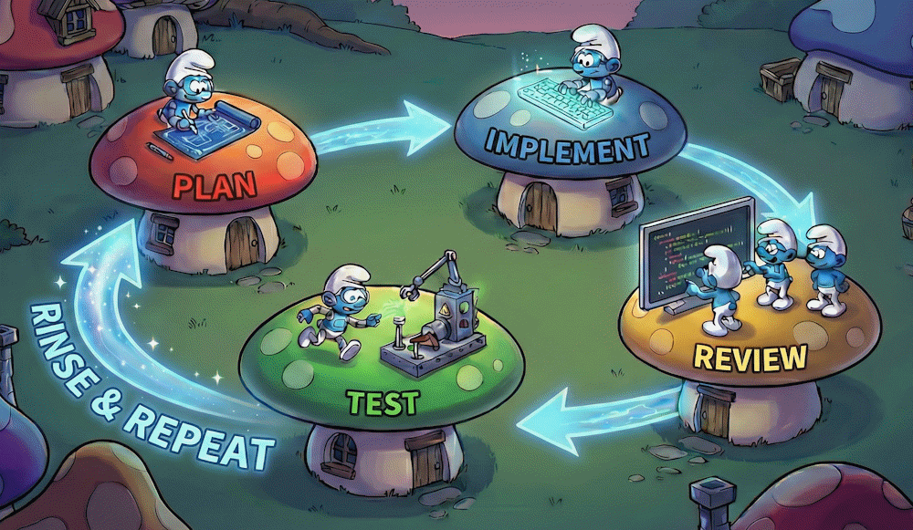
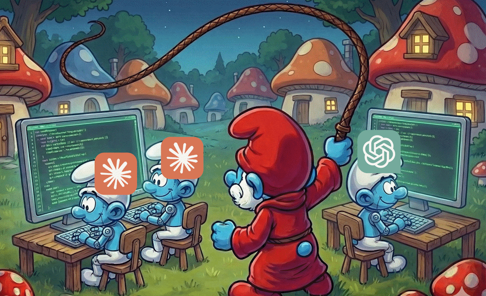

      

## What is TRIP?

A structured development workflow for AI coding agents that brings **memory**, **consistency**, and **reduced hallucination** (only humans should) to AI-assisted development. TRIP helps you enter flow state and eat features like buttered noodles.
It is also the acronym (reversed) of the historical 4-phases development cycle: **P**lan, **I**mplement, **R**eview, **T**est.  
**Note:** Since v2.0.0 the flow is even simpler **Plan → Implement → Release** — review and test moved *inside* Implement as a testing gate and an automatic Codex review loop, every feature passes through all 4 phases with fewer commands.

TRIP was initially designed for Claude Code using the [Agent Skills](https://agentskills.io/home) open standard (`SKILL.md`). Also compatible with OpenCode, Codex CLI, Mistral Vibe and more.

## Why TRIP?

There are tons of AI coding workflows out there like [Superpowers](https://github.com/obra/superpowers), [BMAD](https://github.com/bmad-code-org/BMAD-METHOD), [Gastown](https://github.com/steveyegge/gastown) and countless others. They might be powerful, but overwhelming for many of us dumb asses.

Even the "simple" ones come with:

- 47 different commands & skills to memorize
- Sub-agents swarm for God-knows-what
- Multi-chapter courses (sometimes paid lol)

**TRIP is different.** It's deliberately minimal:

| That's it           | Just these                                             |
| ------------------- | ------------------------------------------------------ |
| `/TRIP-1-plan`      | Think before you code (Codex reviews the plan)         |
| `/TRIP-2-implement` | Codex writes, you review, tests gate, Codex re-reviews |
| `/TRIP-3-release`   | Version, changelogs, docs, commit, tag, merge, push    |

Three numbered skills. One architecture file. Zero PhD required.

The onboarding is: copy the folder, run init, start coding. If you can count to 3, you can TRIP.

It was kept stupid simple because **the goal is to ship features, not to master a workflow**. The workflow should disappear into the background, not become a project of its own.

## Getting Started

Requirements for the bundled Codex scripts: Bash, Codex CLI, `jq`, and GNU coreutils (`realpath` and GNU `date`). On Windows, run them from WSL or a shell with those tools installed.

1. Copy the `skills/` folder contents to your repo's `.claude/skills/` or whatever
2. Run `/TRIP-init [YourProjectName]`
3. Follow the interactive prompts
4. Review and approve the generated ARCHI.md

### Additional For Mistral users (if they exist)

Also copy `AskUserQuestion/` to your agent `/skills/`, it provides the `AskUserQuestion` tool that TRIP workflow rely on.  

Et voila ! Start using the skills like `/TRIP-1-plan auth for this webapp`, `/TRIP-2-implement @auth-plan.md`, etc.

https://github.com/user-attachments/assets/d37bbc60-1868-4fa8-9be6-083b60d6a53d

## The Heart of TRIP: ARCHI.md

The `ARCHI.md` file is the **central nervous system** of this workflow. It serves as the AI agent's **long-term memory** of your codebase.

### Why ARCHI.md Matters

**1. Persistent Context Across Sessions**

AI agents have no memory between sessions. Every new conversation starts from zero. ARCHI.md solves this by providing a comprehensive, always-up-to-date snapshot of your architecture that the agent reads at the start of each task. Unlike tool-specific files like `CLAUDE.md` or `AGENTS.md`, ARCHI.md is purely about architecture. It's tool-agnostic, so it works with any agent. You can still reference it from your `CLAUDE.md` to include it in all conversations.

**2. Token Savings & Reduced Hallucination**

Without ARCHI.md, your agent must glob, grep, and read multiple files to piece together the architecture from scratch for every single session. This wastes tokens and leads to guessing: _"There's probably a utils folder..."_, _"This project likely uses Redux..."_. ARCHI.md eliminates both problems. The agent gets the full picture in one read for minimal exploration & hallucination.

**3. Balanced Detail vs Token Usage**

ARCHI.md is designed to be:

- **Detailed enough** to provide meaningful context, **concise enough** to not waste tokens
- **Structured** for quick navigation
- **Updated** after every architectural change

It's not a dump of your entire codebase, rather a curated architectural guide.

## The Init Process

The `TRIP-init` skill is a **script written in human language** that programmatically bootstraps the TRIP workflow in any repository.

### What Init Does

1. **Creates the docs structure** - Folders for plans, changelogs, reviews, tests, memos
2. **Explores your codebase** - Identifies languages, frameworks, patterns, conventions
3. **Classifies your project** - Web frontend? CLI tool? Embedded firmware? Library?
4. **Generates ARCHI.md** - Tailored to your specific project type
5. **Customizes the skills** - Replaces placeholders with your project's specifics

### The Placeholder System

The generic TRIP skills contain placeholders like:

- `[PROJECT_NAME]` - Your project's name
- `[VERSION_FILE]` - Where your version is stored (package.json, Cargo.toml, etc.)
- `[ADAPT_TO_PROJECT: ...]` - Sections to customize

Init walks you through questions and replaces these placeholders based on your answers, creating a workflow tailored to your project.

## More Skills

### `/codex-implement`

Implementation delegated to Codex CLI in a **workspace-write sandbox**: it reads the approved plan, edits the working tree, runs your lint/build, and reports back with a completion tag. Your main agent then self-reviews the diff and fixes issues directly. Persistent thread per plan, so multi-phase plans resume with full context. Integrated into TRIP-2-implement as the default implementation path.

### `/codex-plan-review` & `/codex-code-review`

Iterative review loops powered by Codex CLI. Plans get a second-opinion review before the user sees them. Code gets reviewed against the plan and a shared checklist after implementation. Both use persistent thread state for multi-round convergence (`start → REQUEST_CHANGES → fix → resume → APPROVED`). Integrated directly into TRIP-1-plan and TRIP-2-implement (after the testing gate).

Per-flow model defaults (implementation vs reviews) live in one file — `codex-plan-review/scripts/_common.sh` — and can be overridden per run via `CODEX_MODEL` / `CODEX_EFFORT` env vars.

### `/TRIP-review` & `/TRIP-test`

The former steps 3 and 4, reborn as on-demand support skills: `/TRIP-review` is the manual fallback/audit review (same checklist as the Codex loop — single source of truth), `/TRIP-test` is the deep test-authoring reference with a seam ladder and a coverage-debt ledger for hard-to-test code.

### `/TRIP-upgrade`

Upgrades an existing project's TRIP skills to a newer version without losing project customizations. Extracts your project-specific content (test commands, checklist sections, technical considerations, version file paths), applies the new workflow skeleton, and re-injects the customizations. Copy the new skills to `new-TRIP/`, run the skill, done.

### `/codex-ask`

A grounded second opinion on **anything** — architecture calls, debugging hypotheses, research conclusions. Codex answers from inside the repo (read-only), threaded per topic for multi-round discussion. Advisory only: no verdict tags, nothing gated. TRIP-research uses it to red-team decision-grade findings before presenting them.

### `/TRIP-hotfix`

Streamlined workflow for production emergencies. Bypasses full TRIP for genuine crises (or lazy debugging).

### `/TRIP-research`

Exploratory investigation with defined compute level. For feasibility studies and technology evaluation. Produces documented findings, not production code.

### `/TRIP-compact`

Run this skill to compact ARCHI.md size while preserving relevance, accuracy, and coverage through summarization and restructuring. Token calculator script included.
Aim for 10,000–15,000 tokens; treat ~20,000 as the hard ceiling.

## Multi-Agent: Using Different LLMs at Different Steps

Just like you wouldn't smell your own fart, an LLM is unlikely to catch bugs in its own implementation. Some people conduct adversarial review with a different session but still the same model, which is..._meh_. The best approach is to introduce a different model in the same reasoning ballpark as the first one, that will most likely catch what the other missed.

As of v2.0.0, this multi-agent approach is **the default workflow**.  
Considering Claude as your main and Codex as the copilot:  
Fable writes the plan, 5.6 Sol reviews it, Luna implements, back to Fable who reviews and fixes the diff, runs the testing gate, then a new Sol thread reviews again the code. All in one claude code session. Writer and reviewer are never the same thread.  
As of mid july 2026, this Fable + GPT5.6 harness combo is absolute peak.

## MCP Servers: Less Is More

Last piece of advice before your new coding quest: Every MCP server you add is extra context, extra latency, and extra confusion. Keep it minimal. The one use case where MCP genuinely shines is **up-to-date documentation**, so your agent stops hallucinating deprecated APIs/whatever. Two servers cover it: [Context7](https://github.com/upstash/context7) for current library & framework docs, and [Exa](https://github.com/exa-labs/exa-mcp-server) for web search when the answer isn't in any doc. No bloat beyond that.

## Contributing

PRs & forks are welcome

Happy tripping ! 🍄
